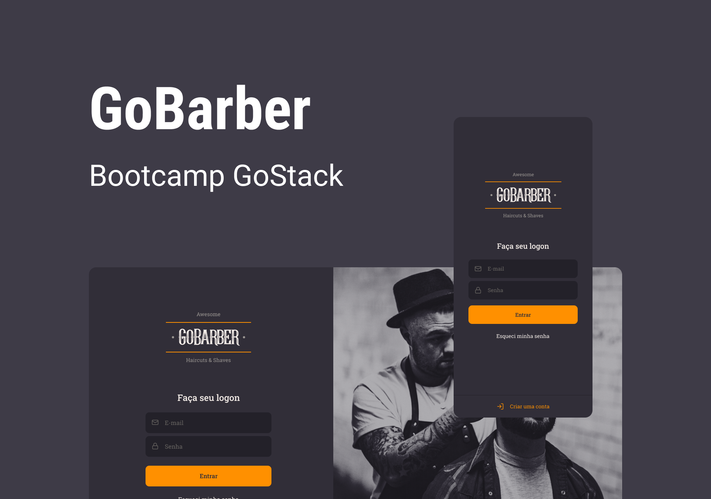

<h5 align=center>
 

🎨 Design por [Tiago Luchtenberg](https://www.instagram.com/tiagoluchtenberg/)

</h5>

---

## 🔖  Sobre
Esse é o mobile da GoBarber, uma aplicação que permite o agendamento de serviços de cabeleireiros.

## 📥 Executar esse projeto no seu computador

- Clonar Repositório: `git clone https://github.com/dxwebster/GoBarber-Mobile`
- Ir para projeto: `cd GoBarber-Mobile`
- Instalar dependências: `yarn install`
- Rodar app no Android Studio: `yarn android`

## 🛠 Como criar esse projeto do zero
Em breve...

## 📕 Licença

Todos os arquivos incluídos aqui, incluindo este _Readme_, estão sob Licença MIT 
Criado com ❤ por [Adriana Lima](https://github.com/dxwebster)

